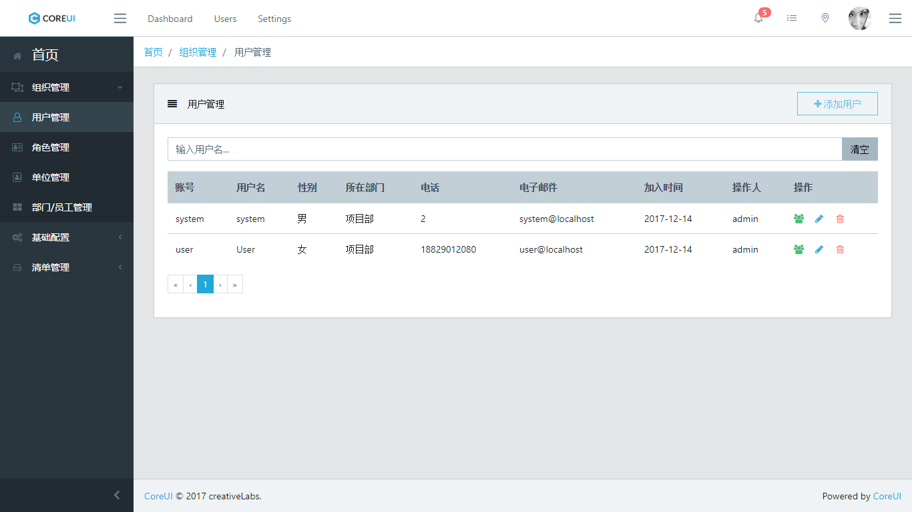
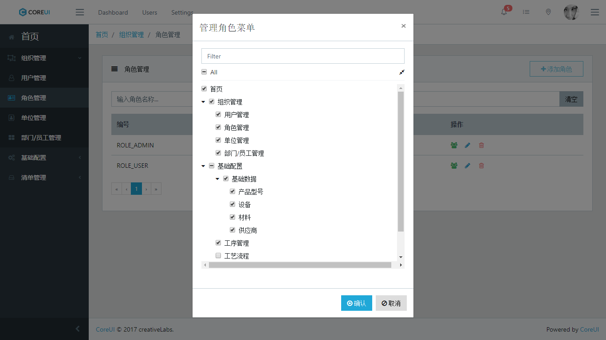
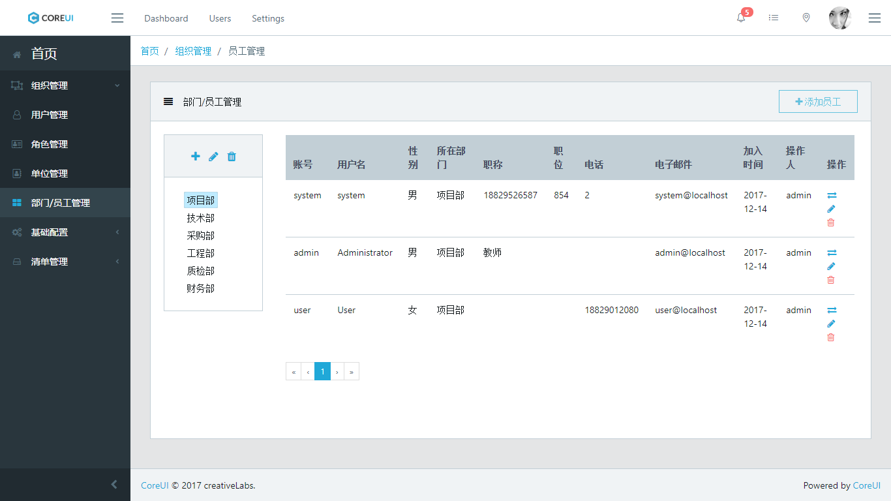

# 基于 Angular5 的管理系统前台

------

该项目配合管理后台一起使用 【[查看](https://github.com/Zeral-Zhang/manager_system)】

系统整体基于 [coreUI](https://coreui.io/) 作为模板，使用 angular5 编写，实现的功能包括：

   - 基于 `token` 的认证登陆
   - 用户过期处理，权限拦截、全局错误处理
   - 动态角色菜单展示
   - 模块懒加载，路由权限
   - 用户管理、角色管理界面、单位管理、部门/员工管理 等若干页面

项目参考并使用了 [`jhipster`](https://www.jhipster.tech/) 脚手架生成的基于 `angular` 项目的部分代码，向大家特别推荐该项目，可以快速方便的生成微服务整套系统等，在此不做过多解释。
   
## 效果展示
<div style="text-align: center"><table><tr>
    <td style="text-align: center">
        <a href="https://github.com/Zeral-Zhang/manager_system/images/user-manage.png">
        
        <br />
        用户管理
        </a>
    </td>
    <td style="text-align: center">
        <a href="https://github.com/Zeral-Zhang/manager_system/images/role-manage.png">
        
        <br />
        角色管理
        </a>
    </td>
    <td style="text-align: center">
        <a href="https://github.com/Zeral-Zhang/manager_system/images/staff-manage.png">
        
        <br />
            部门/员工管理
        </a>
    </td>
</tr>
</table>
</div>

## 开发运行

``` bash
 yarn 或者 npm i 安装
```

运行：

``` bash
 yarn start 或者 npm start
```
查看 `http://localhost:4200/`

## 项目结构

主结构：
```
manager_web
├── src
│   ├── app            // 存放项目模板界面和业务界面及路由文件 （核心） 
│   ├── assets         // 资源文件
│   ├── core           // 共享的组件及模块以及工具
│   ├── environments   // 环境配置文件
│   ├── img            // logo 及图标
│   └── scss           // 样式
└── package.json
```
app 模块：
主结构：
```
app
├── components           // 项目框架组件
├── containers           // 项目框架布局，分为全屏布局、内容布局
├── directives           // 框架指令 
├── views                // 功能模块 
│   ├── base-config      // 基础配置模块
│   ├── basic            // 基础模块
│   ├── dashboard        // 看板模块
│   └── ...               
├── app.routing.ts       // 全局路由
├── app.module.ts        // 主模块配置
└── app.component.ts     // 顶层组件
```
共享模块：
```
core
├── auth                 // 授权，权限结构指令，账号角色
├── components           // 共享组件，选人组件
├── constants            // 常量 
├── interceptor          // 拦截器 
│   ├── auth.interceptor.ts                 // 授权拦截
│   ├── auth-expired.interceptor.ts         // 过期拦截
│   ├── errorhandler.interceptor.ts         // 错误处理拦截
│   ├── notification.interceptor.ts         // 提示消息拦截
│   └── http.provider.ts                    // 拦截配置
├── menu                 // 菜单
├── model                // 实体模型
├── user                 // 用户模块
├── toast                // 提示工具
├── shared.module.ts     // 共享模块配置
├── shared-jqwidgets.module.ts     // 集成 jqwidgets 组件库
└── shared-libs.module.ts          // 常用的模块工具集成

```
## 帮助

项目只是完成了部分功能，后续开发计划暂无，如有任何技术或非技术问题，请转步到个人博客留言：

> Zeral's Blog: [zeral.top](zeral.top)


